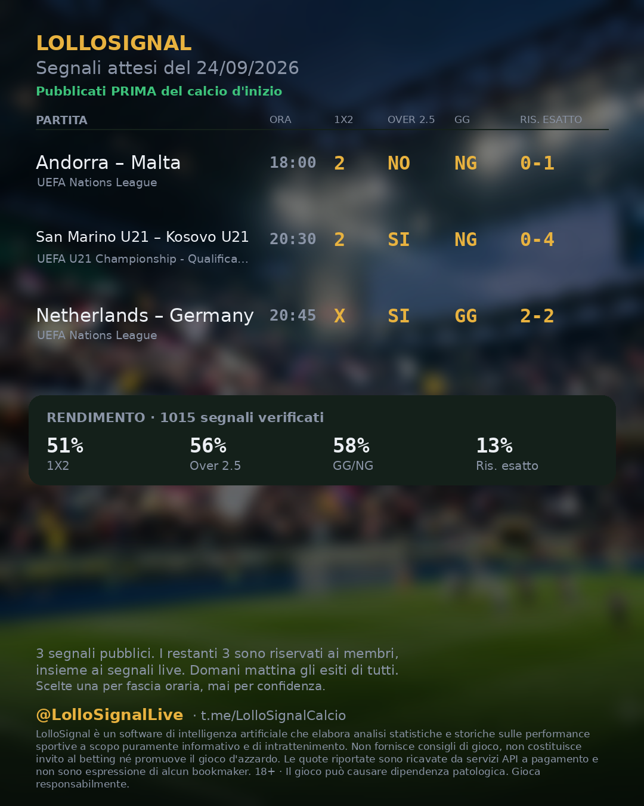
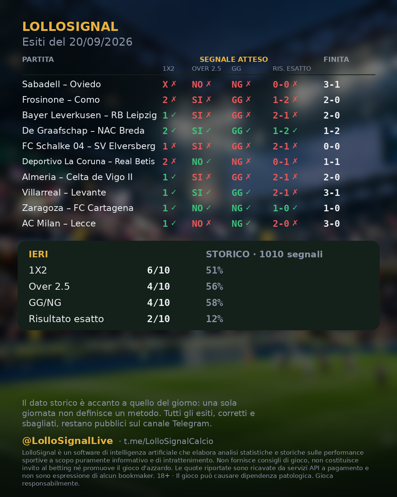
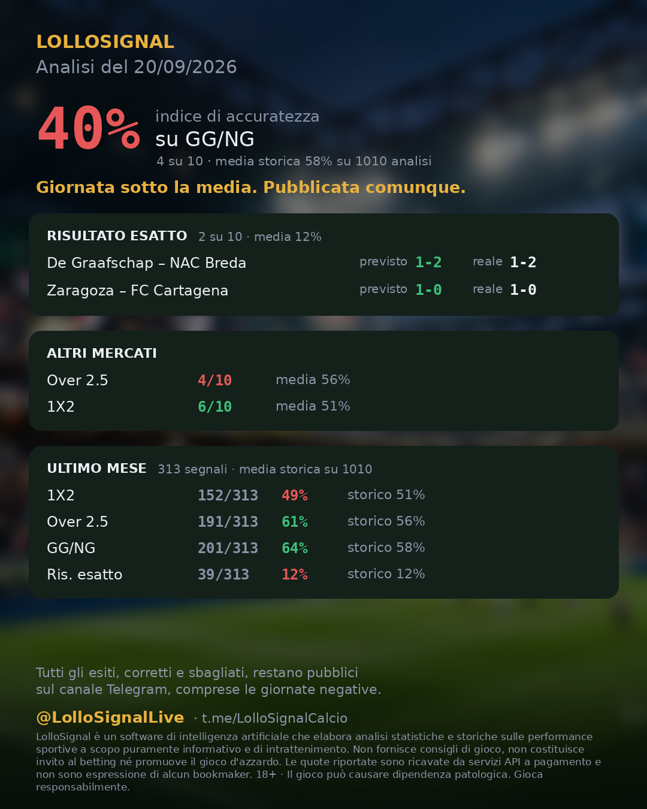
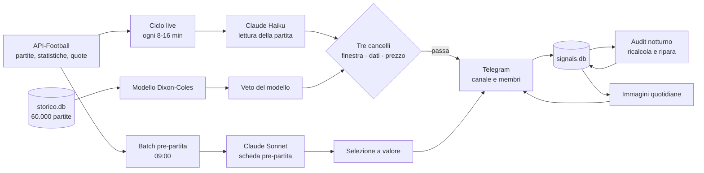

# LolloSignal — analisi calcistica live e pre-partita con dati e AI

> **Repository vetrina, in sola lettura.** Qui c'è una selezione del codice di un
> sistema in produzione dall'aprile 2026, con i suoi test e la documentazione delle
> scelte. Il bot completo resta in un repository privato. Vedi [Note legali](#note-legali).
>
> 🇬🇧 **English summary [below](#english-summary).**

<p align="center">
  
  
  
</p>

<p align="center"><sub>Tre immagini generate ogni giorno in automatico dal database.
Da sinistra: i segnali pubblicati <b>prima</b> che si giochi, gli esiti del giorno dopo,
la lettura della giornata. La terza dice «Giornata sotto la media. Pubblicata comunque.»
ed è voluto: si pubblicano anche le giornate storte.</sub></p>

---

## Cosa fa

Un bot Telegram che segue il calcio europeo in tempo reale e prima delle partite:

- **Live.** Ogni 8-16 minuti analizza le partite in corso di 15 campionati e coppe:
  statistiche al minuto (tiri, xG, possesso, corner), eventi, quote live. Emette un
  segnale (Over, Goal/Goal, prossimo marcatore, ribaltone) solo se supera **tre
  cancelli indipendenti**: la finestra temporale ammessa, la convergenza dei dati e un
  prezzo minimo ricavato dal win rate misurato.
- **Pre-partita.** Ogni mattina sceglie 6-10 partite con un criterio a punteggio
  (valore, affidabilità della lega, leggibilità, completezza dei dati) e produce una
  scheda per ciascuna: 1X2, Over 2.5, Goal/No Goal, risultato esatto.
- **Verifica.** Ogni notte ricalcola l'esito di ogni segnale contro i dati ufficiali
  e **ripara da solo** il database. Un interruttore di sicurezza lo ferma se le
  correzioni superano il 25%, perché a quel punto il guasto è nel calcolo, non nei dati.
- **Pubblicazione.** Genera le immagini quotidiane per il canale Telegram e Instagram,
  con l'avvertenza di legge presa da un'unica fonte.

## In numeri

| | |
|---|---|
| In produzione dal | aprile 2026, con aggiornamenti continui |
| Commit | 410 |
| Codice Python | ~42.000 righe, 120 moduli |
| Test automatici | ~1.460 nel repository privato, **396 in questa vetrina** |
| Segnali pre-partita pubblicati e verificati | 1.025 |
| Segnali live verificati | 634 |
| Archivio storico per il modello | ~60.000 partite, 44 leghe, 5 stagioni |
| Costo operativo | ~2,50 $/giorno di AI più API dati e server |

## Risultati misurati, compresi quelli scomodi

| Mercato (pre-partita, 1.025 segnali) | Il sistema | Una costante* | |
|---|---|---|---|
| 1X2 | **50,5%** | 47,2% («1») | +3,3 punti |
| Over 2.5 | 56,0% | 53,5% («Over») | +2,5 |
| Goal/No Goal | 58,0% | 56,2% («Goal») | +1,8 |
| Risultato esatto | 12,4% | 12,9% («1-1») | **−0,5** |

<sub>*«Una costante» significa dire sempre la stessa cosa: sempre «1», sempre «Over»,
sempre «1-1». È il punto di riferimento onesto: un sistema che non lo supera non
aggiunge informazione.</sub>

Il sistema batte la costante sui mercati principali, ma **alle quote reali dei
bookmaker il rendimento resta negativo**, come per quasi chiunque. Lo misura e lo
dichiara, invece di nasconderlo. Molte delle decisioni documentate in
[`docs/DECISIONI.md`](docs/DECISIONI.md) nascono proprio da misure che hanno smentito
un'idea di partenza.

## Architettura



Dettagli in [`docs/ARCHITETTURA.md`](docs/ARCHITETTURA.md).

## Cosa c'è in questa vetrina

| Modulo | Cosa mostra |
|---|---|
| `modello_storico.py` | Modello di Poisson bivariato con correzione **Dixon-Coles**, stimato su 5 stagioni |
| `valida_modello.py` | Banco di misura fuori campione: stagione 2025 esclusa dall'addestramento, confronto con la media di lega e con il mercato |
| `veto_modello.py` | Il modello come **veto**: può solo togliere un segnale, mai proporlo |
| `quota_filter.py` | Prezzo minimo ricavato dal win rate misurato: `(1/winrate) × (1+margine)` |
| `live_data.py` | Convergenza dei dati live: due indicatori concordi, **nella direzione giusta** |
| `selezione_valore.py` | Selezione pre-partita a punteggio, con fasce orarie e ripiego automatico |
| `prematch_adattivo.py` | Probabilità di sette mercati e quota equa per partita |
| `exact_score_odds.py` · `htft_odds.py` | Lettura dei listini dei bookmaker, calcolo di quote combinate (dutching) |
| `prediction_validator.py` | Coerenza matematica delle risposte dell'AI (es. risultato 2-1 con «No Goal» = errore) |
| `ombra.py` | Modalità ombra: modello, AI e mercato registrati fianco a fianco per confrontarli |
| `checkup_live.py` | Autocontrollo serale: distingue gli errori **nostri** da quelli del fornitore |
| `accessi.py` | Stati di accesso degli iscritti: attivo, scaduto, bannato, sconosciuto |
| `immagine_*.py` | Generazione delle immagini (Pillow), con layout che si adatta al contenuto |
| `profilo_lega.py` · `coefficienti_uefa.py` | Contesto storico di lega e forza UEFA inseriti nel prompt dell'AI |

**Non inclusi**, e restano privati: il bot Telegram (`bot.py`, 12.600 righe), la
raccolta dati dalle API, i prompt, i database e i pagamenti.

### Eseguire i test

```bash
pip install -r requirements.txt
python3 run_tests.py
```

Risultato atteso: `Ran 396 tests ... OK (skipped=27)`. I test saltati verificano
l'aggancio al bot completo o leggono l'archivio storico, e non possono girare senza.

## Come è stato costruito

Il progetto è nato e cresciuto con un metodo preciso: **decido io le regole, l'AI le
implementa, i dati giudicano entrambi.**

Le decisioni di prodotto sono state prese da me: quali mercati, quali finestre di
gioco, cosa vuol dire «ribaltone», quando un segnale va pubblicato, cosa mostrare al
pubblico. Il codice è stato scritto insieme a **Claude Code** (Anthropic) con regole di
lavoro fisse:

- **Misurare prima di cambiare.** Nessuna soglia a occhio: il finestrino 70-80' per i
  ribaltoni è stato chiuso dopo averne contati **zero su 11** oltre il 75'.
- **Test che cadono se il comportamento si rompe**, non solo se cambia una stringa. Le
  modifiche importanti sono verificate per *mutazione*: si rompe apposta il codice e
  si controlla che un test se ne accorga.
- **Un punto di ritorno prima di ogni modifica**: tag git e backup del database.
- **Scrivere il perché**, non solo il cosa. La memoria del progetto è un documento
  vivo di ogni decisione, con il numero che l'ha motivata.

Il risultato è un sistema che una sola persona tiene in produzione, e in cui si può
risalire alla ragione di ogni riga.

## Adattabile ad altri contesti

La parte calcistica è il caso d'uso. Il metodo e i componenti si trasferiscono a
qualunque attività che deve **decidere su dati che arrivano in continuo e verificare
poi se aveva ragione**:

- **Aziende di dati sportivi, media, fantacalcio**: il motore di analisi e le immagini
  automatiche sono già un prodotto.
- **Monitoraggio e allarmi** (logistica, e-commerce, IoT): ciclo di acquisizione con
  budget di chiamate, cache con scadenza, controlli che separano gli errori propri da
  quelli dei fornitori.
- **AI nei processi aziendali**: un modello linguistico dentro regole esplicite,
  validazione dell'output, confronto con un modello statistico e con una baseline.
- **Reportistica automatica**: dal database all'immagine o al messaggio pubblicato,
  senza passaggi manuali.

Per aziende che assumono o selezionano profili: questo repository è la prova di come
imposto un problema reale dall'idea alla produzione, e di come lavoro con gli
strumenti di AI senza delegare il giudizio.

## Contatti

**lollo4971** su GitHub · canale Telegram
[@LolloSignalCalcio](https://t.me/LolloSignalCalcio) · bot
[@LolloSignalLive_bot](https://t.me/LolloSignalLive_bot) · Instagram
[@lollosignallive](https://instagram.com/lollosignallive)

📧 **Contatto diretto:** [lorezoserafini7@gmail.com](mailto:lorezoserafini7@gmail.com)

---

## English summary

**LolloSignal** is a production Telegram bot, running since April 2026, for live and
pre-match football analysis across 15 European leagues and cups. This repository is a
**read-only showcase**: a curated selection of modules with their tests. The full
bot stays private.

**What it does.** Live, it analyses in-play statistics (shots, xG, possession,
corners), events and live odds every 8-16 minutes. It emits a signal only through
three independent gates: allowed time window, data convergence, and a minimum price
derived from the measured win rate. Pre-match, it scores and selects 6-10 fixtures a
day. Every night it re-checks every outcome against official data and **repairs its
own database**, with a circuit breaker if corrections exceed 25%. It also generates
the daily images for Telegram and Instagram.

**Numbers.** ~42k lines of Python, 410 commits, ~1,460 automated tests (396 here),
1,025 verified pre-match signals, 634 live signals. A bivariate Poisson model with
Dixon-Coles correction trained on ~60,000 matches, validated out of sample.

**Honest results.** It beats a constant baseline on 1X2 (50.5% vs 47.2%), Over 2.5
and BTTS, and it does **not** on exact score. At real bookmaker odds the return is
negative, and the project measures and states this instead of hiding it.

**How it was built.** I set the product rules; the code was written with **Claude
Code** under strict practices: measure before changing, behaviour-level tests checked
by mutation, a rollback point before every change, and a written rationale for each
decision.

**Transferable to** sports-data and media companies, real-time monitoring and
alerting, LLMs embedded in business processes with validation and baselines, and
automated reporting.

Run the tests: `pip install -r requirements.txt && python3 run_tests.py`.

Contact: [lorezoserafini7@gmail.com](mailto:lorezoserafini7@gmail.com)

---

## Note legali

© 2026 lollo4971. **Tutti i diritti riservati.** Il codice è pubblicato solo perché
possa essere letto e valutato. Non è concessa alcuna licenza di uso, copia,
modifica o distribuzione. Vedi [`LICENSE`](LICENSE).

LolloSignal è un software di analisi statistica a scopo informativo. Non fornisce
consigli di gioco e non promuove il gioco d'azzardo. 18+ · Il gioco può causare
dipendenza patologica.
